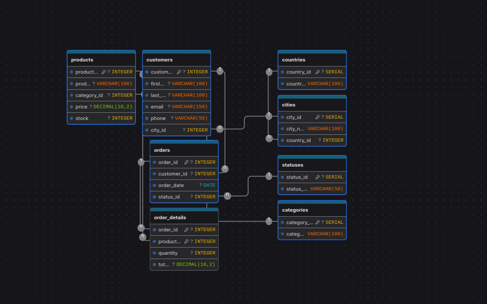

# Modelado de la base de datos - Proyecto analisis de ventas.

Para el guardado de datos he optado por utilizar postgreSQL. He desarollado la base datos en base a los archivos csv que se encuentran en la plataforma.

Estos son 4 documentos: customers, order_details, orders y products. En base a la estructura de estos datos he diseñado tablas afines a cada uno de ellos.

## Diagrama

En el diseño de la base de datos se han definido correctamente las claves primarias y las claves con el objetivo de garantizar la integridad referencial entre las diferentes tablas.

Cada tabla principal cuenta con una clave primaria que permite identificar de manera única cada registro. En la tabla countries, la clave primaria es country_id, la cual identifica cada país. De manera similar, en la tabla cities, la clave primaria es city_id, mientras que en categories y statuses las claves primarias son category_id y status_id respectivamente.

En cuanto a las claves foráneas, estas se utilizan para establecer relaciones entre las tablas. La tabla cities contiene la clave foránea country_id, que hace referencia a la tabla countries, indicando a qué país pertenece cada ciudad. En la tabla customers, el campo city_id es una clave foránea que referencia a cities, permitiendo conocer la ubicación del cliente.
